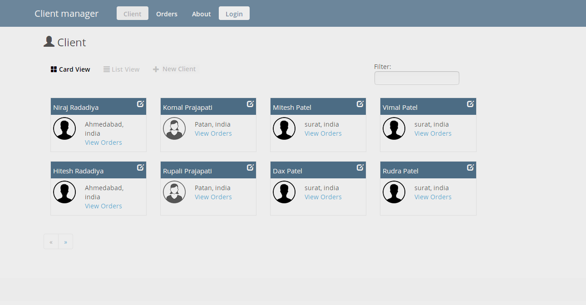
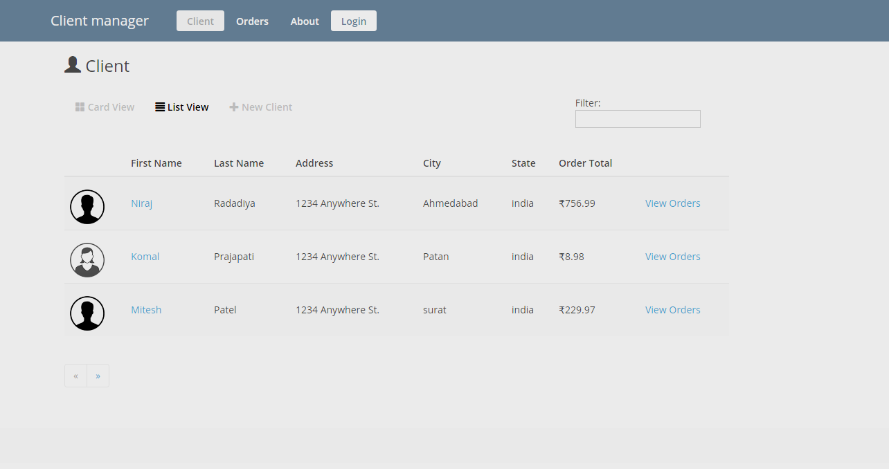
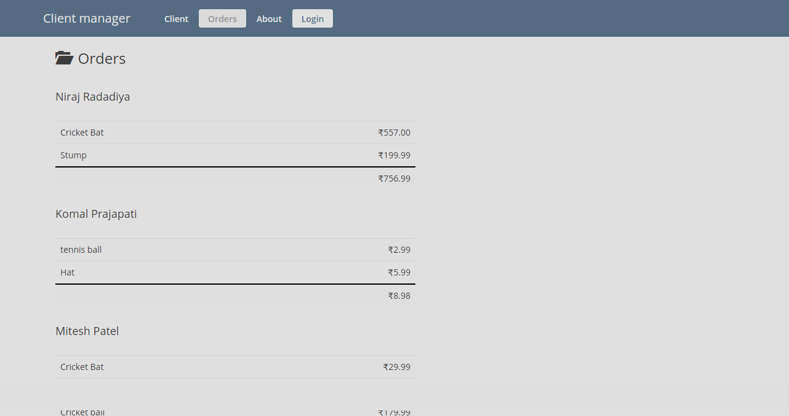
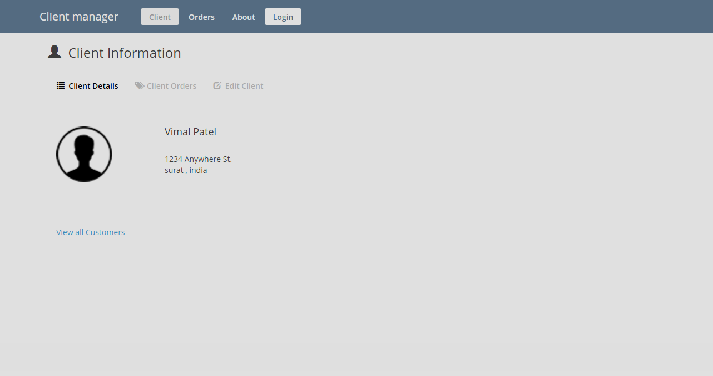

# Angular2 App

* TypeScript version that relies on classes and modules
* Modules are loaded with System.js
* Defining routes including child routes and lazy loaded routes
* Using Custom Components including custom input and output properties
* Using Custom Directives
* Using Custom Pipes

## Running the Application

1. Install `Node.js 6.5` or higher. *IMPORTANT: The server uses ES2015 features so you need Node 6.x or higher!!!!*

1. Run `npm install` to install app dependencies

1. Run `npm start` in a separate terminal window to build the TypeScript, watch for changes and launch the web server

1. Go to http://localhost:3000 in your browser

Simply clone the project or download and extract the .zip to get started. Here are a few
screenshots from the app:

  

  

  

1. Run `npm install` to install app dependencies

1. Optional (for AOT). If you'd like to run the application using Ahead of Time (AOT) compilation, 
   run the following command to set the NODE_ENV environment variable to production and create an AOT build:

    *Mac*:      `export NODE_ENV=production`
    *Windows:   `set NODE_ENV=production`

1. Run `npm run build` in a console window. This will generate the required script assets needed to run the application
   and place them in the `src/devDist` folder for a development build or `src/dist` for a production/AOT build (if you performed the previous step). 
   It will also watch for any code changes that are made and rebuild the script bundles as needed.

1. Run `node server.js` in another command window to start the server.

1. Navigate to http://localhost:3000 in a browser.

